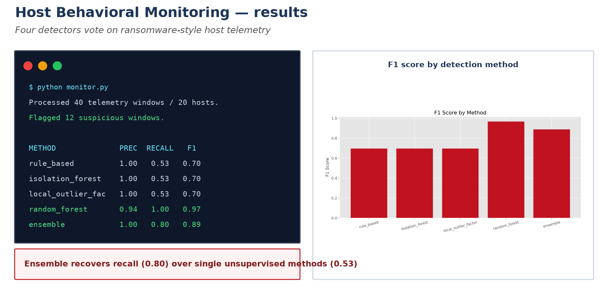
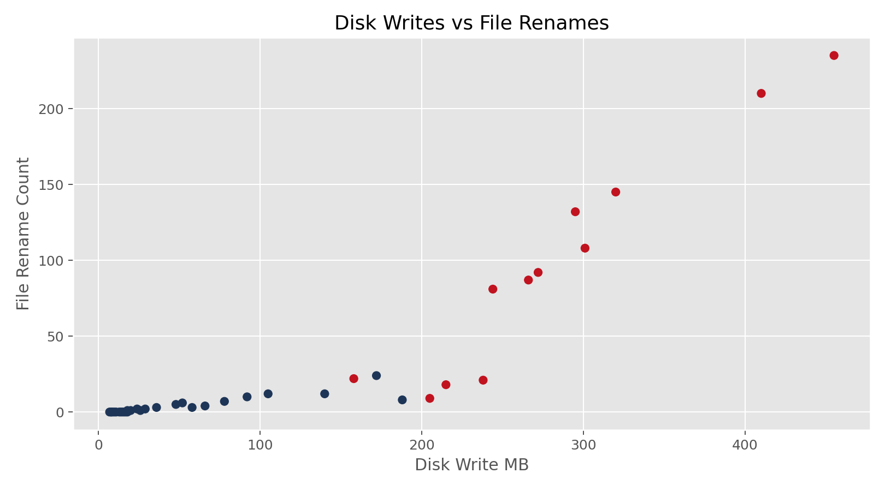
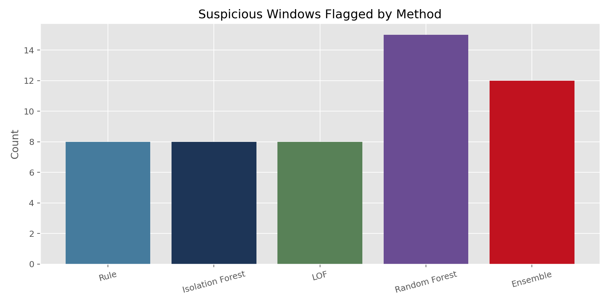
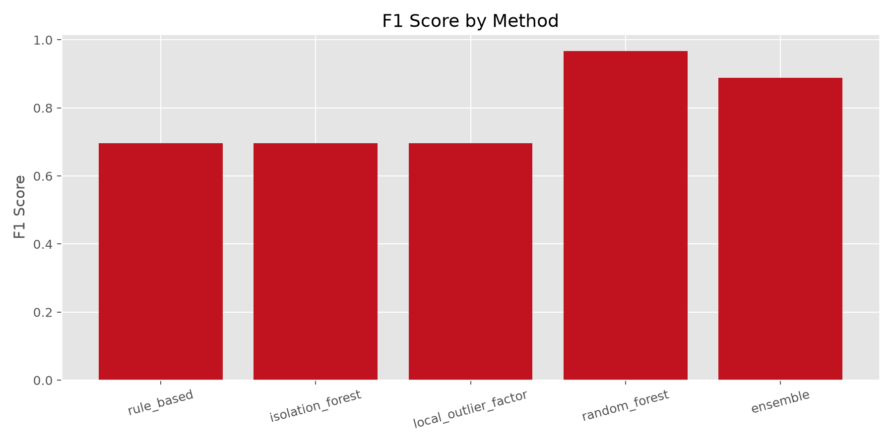
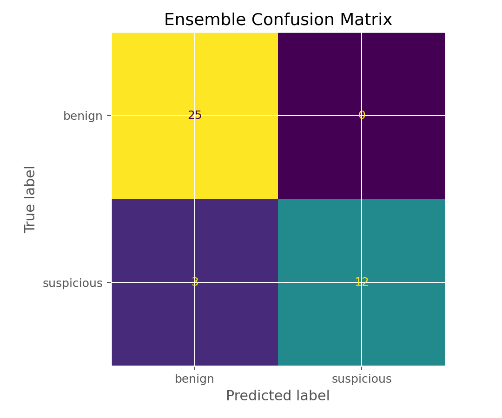

# Host-Based Behavioral Monitoring and Anomaly Detection

[](https://github.com/Farooq-Syed/host-based-behavioral-monitoring-and-anomaly-detection/actions/workflows/ci.yml)


This project analyzes host telemetry windows to detect suspicious behavior associated with ransomware-style activity, destructive scripting, and resource abuse. It combines rule-based detection with machine learning to compare how different methods behave on the same telemetry stream.

Developed with AI coding assistance; the author chose the telemetry design, detection
comparisons, evaluation framing, debugging direction, and final interpretation of the
results.

## Results at a glance



Four detectors score each telemetry window and vote. On the sample the ensemble
recovers recall (0.80) over any single unsupervised method (0.53) while holding
precision at 1.00. See [PAPER.md](PAPER.md) for the method and [JOURNAL.md](JOURNAL.md)
for the development notes. For method and threat-model citations, see
[REFERENCES.md](REFERENCES.md).

## Features

- host telemetry monitoring from CSV
- rule-based suspicious activity scoring
- `Isolation Forest` anomaly detection
- `Local Outlier Factor` anomaly detection
- `Random Forest` supervised classification when labels are available
- ransomware **progression** detection across windows (recon -> tampering -> encryption)
- process **reputation** enrichment (extendable with a CSV)
- ensemble voting, plus a **precision-calibrated** ensemble variant
- metrics, plots, and notebook-based analysis

## Project Structure

```text
.
|-- monitor.py
|-- requirements.txt
|-- .gitignore
|-- LICENSE
|-- data/
|   `-- sample_host_telemetry.csv
|-- assets/
|   |-- disk_writes_vs_renames_sample.png
|   |-- method_comparison_sample.png
|   |-- f1_comparison_sample.png
|   `-- ensemble_confusion_matrix_sample.png
|-- results/
|   |-- sample_metrics.json
|   `-- sample_summary.json
`-- notebooks/
    `-- host_behavior_analysis.ipynb
```

## Installation

```powershell
python -m pip install -r requirements.txt
```

## Usage

Run the sample dataset:

```powershell
python monitor.py
```

Use a different anomaly fraction:

```powershell
python monitor.py --contamination 0.15
```

## Larger synthetic dataset

The 40-row sample makes every method look near-perfect, which is misleading.
`generate_telemetry.py` produces a larger, deliberately harder synthetic dataset
(overlapping class distributions, five behavior archetypes, a few percent of label
noise) so the metrics carry more weight. See [docs/DATA.md](docs/DATA.md) for the
design rationale — the data is synthetic and for development, not a benchmark.

```powershell
python generate_telemetry.py --rows 2000 --output data/synthetic_host_telemetry.csv
python monitor.py --input data/synthetic_host_telemetry.csv
python monitor.py --input data/synthetic_host_telemetry_eval.csv --ensemble weighted
```

On the 2,000-row set the methods land where you would expect on a non-trivial problem:
rule-based and Isolation Forest around F1 0.6–0.7, LOF weaker, a supervised Random
Forest strong but not perfect (~0.95), and the ensemble in between — a realistic
spread rather than everything scoring 1.00.

On the harder tracked evaluation set, the recalibrated weighted ensemble now lands at
approximately **precision 0.96 / recall 0.79 / F1 0.87**, outperforming the older
weighted-majority threshold and the simple two-vote ensemble on recall while keeping
precision high.

## Output

The script writes:

- `output/alerts_report.csv`
- `output/summary.json`
- `output/metrics.json`
- `output/plots/disk_writes_vs_renames.png`
- `output/plots/method_comparison.png`
- `output/plots/f1_comparison.png`
- `output/plots/ensemble_confusion_matrix.png`

## Telemetry Features

The sample dataset includes:

- CPU usage
- memory usage
- disk write volume
- file write count
- file rename count
- network connection count
- child process count
- unsigned binary execution
- suspicious extension changes
- entropy score
- shadow copy activity

## Detection Logic

### Rule-Based Detection

The rule-based method flags windows with a combination of high CPU, heavy disk writes, mass file renames, extension changes, high entropy, shadow copy tampering, and unsigned binaries.

### Isolation Forest and LOF

These models are used to detect anomalous host behavior without relying on exact signatures.

### Random Forest

When labels are available, the supervised model is evaluated with cross-validated predictions to estimate how well the telemetry separates benign and suspicious activity.

### Ensemble

The final alert uses a simple vote across the rule-based detector and the three ML methods.

### Progression

Ransomware is a sequence, not a snapshot. The progression detector walks each host's
windows in time and only counts the encryption stage as part of an attack trajectory
when recon (mass renames, unsigned code) and shadow-copy tampering were observed
earlier on that same host.

### Calibrated ensemble

`--ensemble weighted` replaces the majority vote with a precision-calibrated
combination: each detector's weight is its precision on the training labels, so a
method that never fires — or fires at random — counts for almost nothing. The newer
calibration anchors the alert threshold to the four core detectors (rules,
Isolation Forest, LOF, Random Forest) rather than the full six-detector weight mass,
with progression and reputation acting as supporting boosts. On the harder 2,000-row
evaluation set this lifts the weighted ensemble to about **F1 0.87** instead of the
older under-triggering behavior.

## Sample Results

The included sample dataset is synthetic and meant to simulate benign activity, ransomware-like behavior, destructive scripting, and high-resource abuse. It is useful for validating the pipeline and showing how different methods compare.

Metrics from `results/sample_metrics.json`:

| Method | Precision | Recall | F1-score | Accuracy |
| --- | --- | --- | --- | --- |
| Rule-based | 1.00 | 0.53 | 0.70 | 0.83 |
| Isolation Forest | 1.00 | 0.53 | 0.70 | 0.83 |
| Local Outlier Factor | 1.00 | 0.53 | 0.70 | 0.83 |
| Random Forest | 1.00 | 1.00 | 1.00 | 1.00 |
| Progression | 0.00 | 0.00 | 0.00 | 0.63 |
| Reputation | 0.67 | 0.27 | 0.38 | 0.68 |
| Ensemble | 1.00 | 0.80 | 0.89 | 0.93 |

> **Reproducibility note.** `requirements.txt` pins exact package versions, so these
> numbers reproduce as-is. The progression row is honest about the sample: none of
> the 40 windows forms a full recon -> tampering -> encryption trajectory, so the
> detector correctly flags nothing on this small set (it matters on the larger
> synthetic set and on real multi-window hosts). The reputation row shows the
> built-in list catching 4 of 15 malicious windows.

These results show a useful pattern for the project:

- unsupervised and rule-based methods catch the strongest suspicious windows
- the supervised model separates the synthetic sample more cleanly
- the ensemble improves recall over the unsupervised methods while keeping precision high

## Sample Visuals

Disk writes vs file renames:



Method comparison:



F1 comparison:



Ensemble confusion matrix:



## Why This Project Matters

This project is meant to look more like host-based detection engineering than a basic system monitor. It focuses on security-relevant resource and file activity patterns, which makes it useful for ransomware-style early warning and suspicious process monitoring.

## Authorship and AI use

- The project framing, telemetry schema, comparisons, and claims are the author's.
- AI assistance was used for coding support and drafting help.
- The author reviewed, edited, tested, and verified the final code and write-up.

## Next Steps

- replace the synthetic sample with larger endpoint telemetry
- ~~add time-series sequence modeling across adjacent windows~~ - done in a first,
  rule-based form (the progression detector); a learned sequence model is the real
  next step
- ~~add process reputation or signer enrichment~~ - done (built-in list, CSV-extendable)
- adapt the input pipeline to Sysmon-style telemetry
